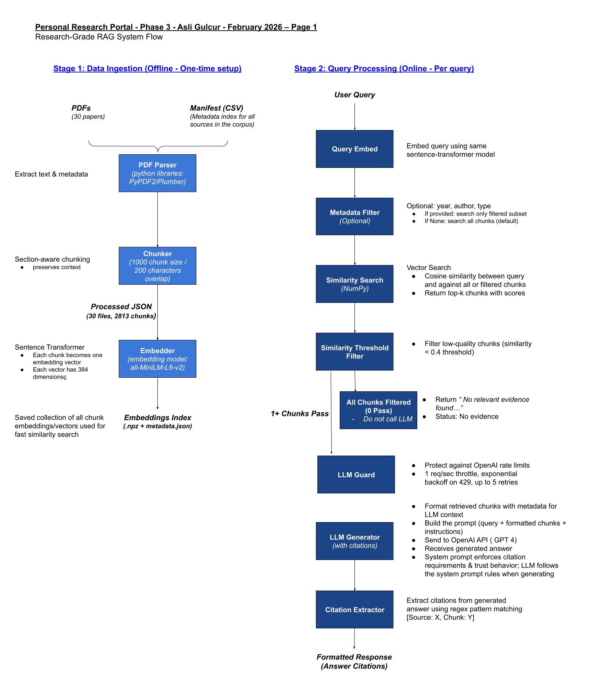
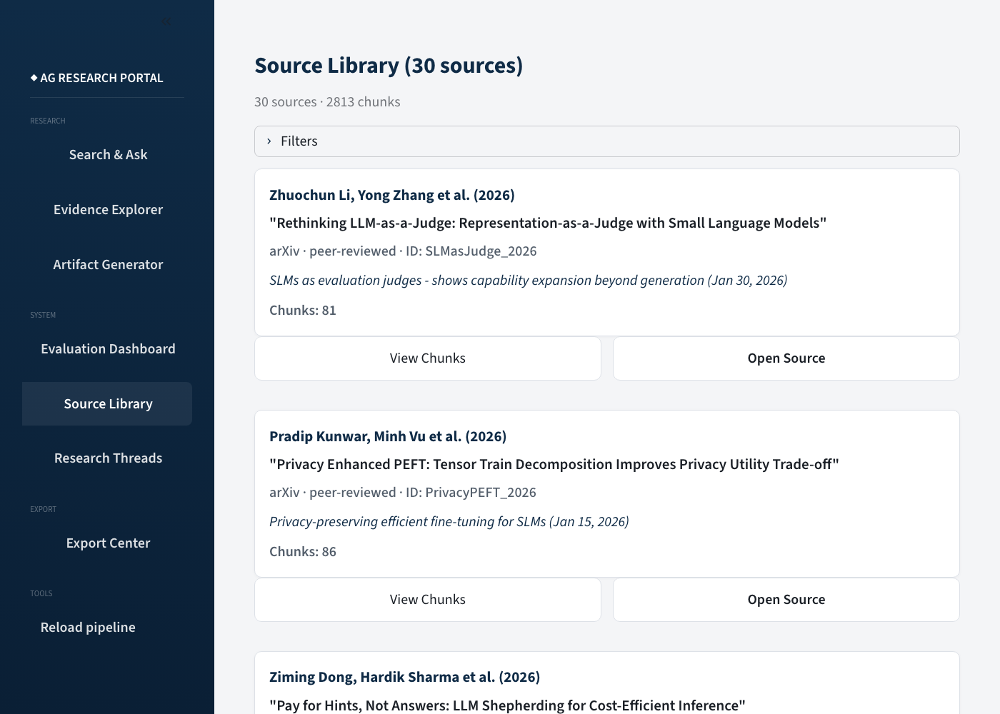
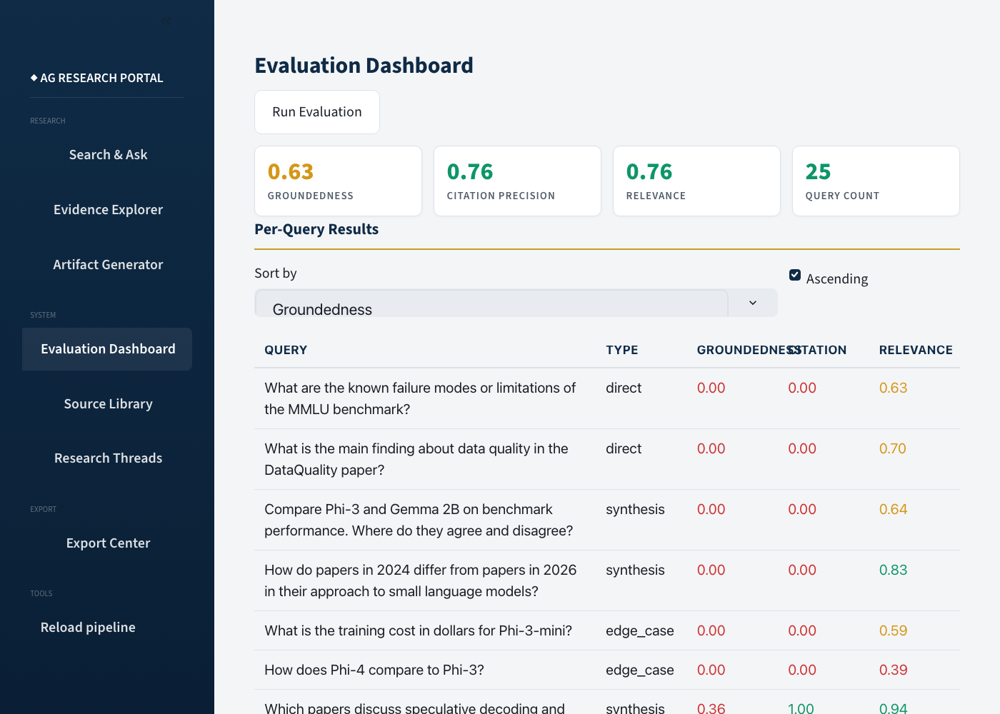

# RAG Research Portal — Small Language Models

A retrieval-augmented generation system over a curated corpus of Small Language Model (SLM) research papers, built around a single design goal: **never let the model fabricate a citation.** It pairs grounded, citation-backed answers with programmatic citation validation and a reproducible evaluation harness.

## Why this exists

Most RAG demos optimize for fluent answers. In a research or enterprise setting, a fluent answer with an invented citation is worse than no answer — it launders a hallucination into something that looks verifiable. This project treats *trust* as a first-class, testable property:

- Every factual claim must carry a citation in the form `[Source: paper_id, Chunk: chunk_id]`.
- Any citation the model emits is checked against the actual corpus. Citations that resolve to no real source are stripped from the answer and surfaced as a red warning — the model is not trusted to police itself.
- When retrieved evidence is weak or absent, the system is designed to refuse rather than guess, and the UI labels the answer's grounding state explicitly.

The corpus domain is small language models (<7B parameters): architectures, training recipes, quantization/compression, and evaluation methodology.

## How it works



The same flow in text:

```
PDFs ──► parse ──► section-aware chunking ──► sentence-transformer embeddings
 (30)                (1000 chars / 200 overlap)     (all-MiniLM-L6-v2, 384-d)
                                                          │
                                                          ▼
                                             outputs/embeddings/*.npz  (2,813 chunks)
                                                          │
 query ─► embed query ─► [metadata filter] ─► cosine top-k ─► similarity ≥ 0.40 gate
                          (year/author/type)   (k=10)          (drops weak chunks)
                                                          │
                                                          ▼
                              GPT-4 generation with a strict grounding prompt
                                                          │
                                                          ▼
                   citation validation: strip any [Source: X] where X ∉ corpus
                                                          │
                                                          ▼
              grounding status (GROUNDED / PARTIALLY GROUNDED / NOT GROUNDED / NO EVIDENCE)
```

**Retrieval.** The corpus is embedded once with `sentence-transformers` (`all-MiniLM-L6-v2`, 384-d, L2-normalized). Queries are matched by cosine similarity computed in NumPy over the in-memory embedding matrix (`SimpleRetriever` in `src/rag/rag_pipeline.py`). Optional metadata filters (publication year range, author substring, source type) are applied *before* scoring so the top-k is drawn only from the eligible subset. A FAISS `IndexFlatIP` path also exists (`src/rag/build_index.py`, `src/rag/retriever.py`) for larger corpora, but the app and evaluator run on the dependency-light NumPy path by default. If `sentence-transformers` fails to load, query embedding falls back to OpenAI `text-embedding-3-small` (512-d truncated to 384 to match the corpus space).

**The 0.40 similarity gate.** After top-k retrieval, chunks below a cosine similarity of 0.40 are dropped before the LLM ever sees them (`RAGPipeline.query`). This is a deliberate trust mechanism: the most reliable way to stop the model from citing irrelevant context is to never put irrelevant context in the prompt. When it drops everything, the pipeline returns no evidence and the UI shows `NO EVIDENCE` rather than an answer.

**Generation.** Retrieved chunks are formatted with their `source_id`, `chunk_id`, and section, then passed to GPT-4 (temperature 0.1) under a system prompt (`src/rag/generator.py`) that enforces: answer only from the excerpts; cite every claim in the exact bracket format; verify the entity in the question matches the entity in the excerpt (`Phi-3 ≠ Phi-4`, `Llama 2 ≠ Llama 3`); flag contradictions between sources; and read benchmark tables column-by-column rather than guessing. Bare citations the model sometimes emits (`GPTQ_2022, GPTQ_2022_chunk_0027`) are normalized back into the canonical bracket form.

**Citation validation (the core trust behavior).** Prompting alone is not trusted. In the app layer (`_validate_citations_in_answer`, `src/app/app.py`), every citation the model produced is parsed and its `source_id` checked against the set of real corpus IDs (from `data/data_manifest.csv` plus the IDs of the chunks actually retrieved). Citations that resolve to nothing — e.g. an invented `[Source: All excerpts]` — are removed from the displayed answer and raise a red "citations were removed" banner. The remaining valid citation count then drives a grounding status strip: `GROUNDED`, `PARTIALLY GROUNDED` (some citations stripped, or the answer both cites chunks and claims information is missing), `NOT GROUNDED`, or `NO EVIDENCE`.

**LLM API guard.** All OpenAI calls go through `call_with_guard` (`src/rag/llm_guard.py`): a 1 request/second throttle (configurable via `OPENAI_REQUEST_INTERVAL`) plus exponential backoff on HTTP 429 (base 1s, doubling, 60s cap, up to 5 attempts). The generator adds a separate short retry loop for transient connection/timeout errors. This keeps batch evaluation from failing mid-run on rate limits.

## Quickstart

**Prerequisites:** Python 3.9+, pip, and an OpenAI API key (used for GPT-4 generation).

```bash
git clone <this-repo> && cd RAG-Research-Portal-Feb-2026

python3 -m venv venv && source venv/bin/activate
pip install -r requirements.txt          # pulls in repo/requirements.txt

echo "OPENAI_API_KEY=sk-your-key-here" > .env
```

The prepared corpus ships with the repo — parsed chunks in `data/processed/` and embeddings in `outputs/embeddings/` — so you can query immediately without re-ingesting.

Launch the portal:

```bash
./run_app.sh                 # picks a free port in 8501–8510
# or: streamlit run src/app/app.py
```

Run the evaluation suite (25 queries; a few minutes, bounded by the 1 req/sec throttle):

```bash
python src/eval/run_evaluation.py        # writes outputs/evaluation_results_<timestamp>.json
```

Single query from the CLI:

```bash
python src/rag/query.py "How do small models compare to large models on reasoning tasks?"
```

> Note: the pipeline and evaluator default to `gpt-4`; the `query.py` convenience script defaults to `gpt-3.5-turbo`. Pass a different model in code if needed.

Rebuild the corpus from scratch (only if you change the PDFs):

```bash
python src/ingest/run_ingestion.py       # parse PDFs → section-aware chunks (data/processed/)
python src/rag/embeddings.py             # re-embed chunks → outputs/embeddings/
```

## The portal

The Streamlit app (`src/app/app.py`) exposes seven views: **Search & Ask** (grounded Q&A with citation chips and grounding status), **Evidence Explorer**, **Artifact Generator** (evidence table, annotated bibliography, synthesis memo), **Evaluation Dashboard**, **Source Library**, **Research Threads** (save and resume lines of inquiry), and **Export Center**.



## Evaluation



The query set (`src/eval/query_set.json`) is 25 queries in three bands, chosen to probe different failure modes:

- **10 direct** — single-fact retrieval (e.g. "What is the parameter count of Gemma 2B?").
- **8 synthesis** — multi-paper reasoning (e.g. comparing compression approaches across the corpus).
- **7 edge cases** — questions with no supporting evidence, out-of-scope, subjective, or definitionally ambiguous (e.g. "Does the corpus show SLMs outperform GPT-4 on all tasks?"). These exist specifically to test refusal.

`src/eval/run_evaluation.py` runs every query and records two metric families:

- **Groundedness** — citation count, citation density (citations per sentence), whether any citation is present, and whether missing evidence is properly flagged.
- **Answer relevance** — query-term coverage, answer-length appropriateness, and directness.

These metrics are intentionally simple and **lexical/heuristic, not model-judged** — term coverage is a keyword overlap, and "flagging" is phrase matching. They give a cheap, deterministic, reproducible signal; they do not measure semantic faithfulness. Treat them as regression guards, not ground truth.

**Trust-behavior testing.** A separate set of 5 adversarial queries is designed so any citation would be fabricated: four ask about entities absent from the corpus (GPT-5, Llama 3.5, Claude 3, Mistral-12B), and one asks for a GPT-4-vs-SLM comparison the corpus does not actually make. In the recorded run (`outputs/trust_behavior_test_results.json`), the system flagged missing evidence in **all 5 (100%)** rather than inventing support. The stricter pass criterion — flag *and* emit no citation-like token at all — was met in 3 of 5; the two misses appended a spurious `[Source: All excerpts]`, which is exactly the class of unresolvable citation the app-layer validator strips at display time. The full methodology and the v1→v2 improvement iteration (the 0.40 gate plus the hardened prompt) are documented in the report under `report/`.

## Notable technical decisions

- **Validation over trust.** Fabricated-citation defense is enforced in code (checking `source_id` against the real corpus), not left to the prompt. Prompting reduces fabrication; validation catches what slips through.
- **Filter before the model, not after.** The 0.40 similarity gate keeps weak context out of the prompt entirely, which is a more reliable fabrication defense than post-hoc answer filtering.
- **Section-aware, sentence-boundary chunking.** Chunks respect detected academic section headers (Abstract, Methods, Results, …) and snap to sentence boundaries within a 1000-char / 200-overlap window (`src/ingest/chunker.py`), so a citation points at a coherent, quotable span rather than a mid-sentence fragment.
- **Table-aware prompting.** The system prompt explicitly instructs the model to map benchmark-table columns to model names before citing a number — a common source of subtle RAG errors on ML papers.
- **Dependency-light default path.** Retrieval runs on NumPy cosine similarity, so the app and evaluator need no FAISS install; FAISS is available but optional.

## Limitations

- Evaluation metrics are lexical, not semantic; they can reward keyword-heavy answers and miss meaning. There is no LLM-as-judge or human-rated faithfulness score.
- On the 25-query run, the "properly flags missing" metric reads low because that metric only credits flagging when an answer has *zero* citations — it does not capture partial or hedged refusals. Refusal behavior is better characterized by the dedicated 5-query trust set.
- Corpus is 30 papers / 2,813 chunks. Retrieval quality and synthesis breadth are bounded by that coverage.
- Generation requires an OpenAI API key and network access; there is no offline generation path (embeddings are local).
- The OpenAI embedding fallback truncates 512-d vectors to 384 to match the corpus space, which is lossy; the primary local `all-MiniLM-L6-v2` path is preferred.

## Repository layout

```
src/
  app/          Streamlit portal, citation validation, grounding status
  ingest/       PDF parsing + section-aware chunking
  rag/          retrieval (NumPy + FAISS), GPT-4 generation, LLM guard
  eval/         query set + evaluation harness
data/
  raw/          source PDFs (30)
  processed/    parsed, chunked JSON per paper
  data_manifest.csv   corpus metadata (title, authors, year, tags, source)
outputs/
  embeddings/   corpus embeddings (.npz) + chunk/embedding metadata
  artifacts/    portal-generated evidence tables, bibliographies, memos
  threads/      saved research threads
scripts/        report + OpenAI re-embedding utilities
report/         evaluation reports and system diagrams
```

## Author

Asli Gulcur.
